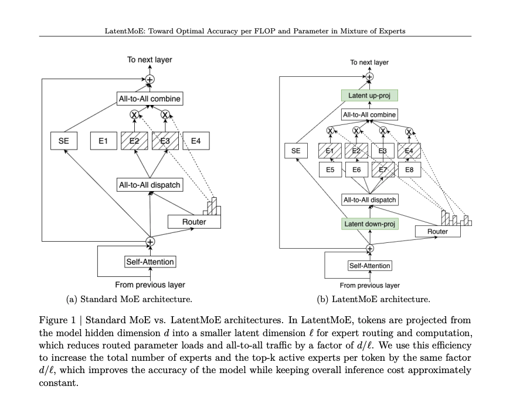

## Latent-MoE



Implementation of <a href="https://arxiv.org/abs/2601.18089">LatentMoE</a>: *Toward Optimal Accuracy per FLOP and Parameter in Mixture of Experts* (Elango et al., NVIDIA 2026) in Pytorch. This is a single-file, dependency-light layer you can drop in place of a standard MoE FFN.

The idea is simple. A standard MoE routes and computes its experts in the model hidden dimension `d`. LatentMoE first projects each token down into a smaller *latent* dimension `l = d / alpha` with a shared down-projection, runs all routed experts inside that latent space, then projects back up to `d`. Because dispatch traffic and expert weights now live in `l` rather than `d`, both all-to-all communication volume and per-expert weight-loading memory drop by a factor of `alpha`.

Those savings are reinvested by scaling the number of experts `N' = alpha * N`, exponentially expanding the space of expert combinations. Two flavors:

- `l-MoE_eff`: keep top-k `K` fixed → match baseline accuracy at lower inference cost.
- `l-MoE_acc`: scale top-k `K' = alpha * K` → match baseline cost while improving accuracy (recommended, Pareto-optimal).

The router and shared experts continue to operate in the original dimension `d`, since they are not the memory/communication bottleneck.

## Install

```bash
uv pip install latent-moe
```

## Usage

```python
import torch
from latent_moe import LatentMoE, LatentMoEConfig

config = LatentMoEConfig(
    d = 2048,          # model hidden dim
    m = 1408,          # expert intermediate width
    n_experts = 64,    # base routed experts (N)
    top_k = 6,         # base active experts per token (K)
    alpha = 4,         # latent compression factor (l = d / alpha)
    n_shared = 2,      # always-on shared experts
    variant = "acc",   # "acc" (iso-cost, higher accuracy) or "eff" (cheaper)
)

layer = LatentMoE(config)

x = torch.randn(2, 128, config.d)  # (batch, seq, d)
y = layer(x)                       # (batch, seq, d)

assert y.shape == x.shape
```

Inspect the asymptotic cost quantities from Table 1 of the paper:

```python
for k, v in layer.cost_summary().items():
    print(f"{k}: {v:,.2f}")
```

## Transformer Usage

```python
import torch
from latent_moe.transformer import TransformerConfig, MoETransformer

torch.manual_seed(0)

cfg = TransformerConfig(
    vocab_size=1000,
    d_model=256,
    n_layers=4,
    n_heads=8,
    n_kv_heads=2,  # GQA: 4 query heads share each KV head
    max_seq_len=128,
    d_ff=256,
    n_experts=8,
    top_k=2,
    alpha=2,
    n_shared=1,
)
model = MoETransformer(cfg)
print(f"params        : {model.num_params():,}")
print(f"primary device: {model.primary_device}")

idx = torch.randint(0, cfg.vocab_size, (2, 64))
targets = torch.randint(0, cfg.vocab_size, (2, 64))

logits, loss = model(idx, targets)
print(f"logits shape  : {tuple(logits.shape)}")
print(f"loss          : {loss.item():.4f}")
print(f"moe aux+z loss: {model.aux_loss.item():.4f}")

loss.backward()
print("backward OK")

out = model.generate(idx[:, :8], max_new_tokens=16, top_k=20)
print(f"generated     : {tuple(out.shape)}")
```

## Training

A complete training script is included at [`examples/training/train.py`](examples/training). It trains the `MoETransformer` on a streamed subset of Wikipedia (HuggingFace `datasets` + GPT-2 tokenizer), uses `torch.optim.Muon` for the 2D hidden weights and `AdamW` for the embeddings, logs with loguru, and checkpoints every `--save-every` steps.

```bash
pip install -e .
pip install -r examples/training/requirements-train.txt

# train the default ~30M-param model for 2000 steps
python examples/training/train.py --steps 2000 --num-articles 2000 --save-every 100

# resume from the latest checkpoint
python examples/training/train.py --resume
```

Key flags: `--steps`, `--batch-size`, `--block-size`, `--num-articles`, `--muon-lr`, `--adam-lr`, `--save-every`, `--ckpt-dir`, `--device`. Every model-shape and training field is exposed as a CLI flag — see [`examples/training/README.md`](examples/training/README.md) for the full list.

`wikimedia/wikipedia` downloads whole parquet shards even when streaming; for a run that starts in seconds, point at a lighter corpus with `--dataset wikitext --dataset-config wikitext-103-raw-v1`.

## Citations

If you use this implementation in your research, please cite both the original paper and this repository:

```bibtex
@article{elango2026latentmoe,
    title   = {LatentMoE: Toward Optimal Accuracy per FLOP and Parameter in Mixture of Experts},
    author  = {Elango and others},
    journal = {arXiv preprint arXiv:2601.18089},
    year    = {2026},
}
```

```bibtex
@software{gomez2026openlatentmoe,
    title   = {Open Latent MoE: A single-file PyTorch implementation of LatentMoE},
    author  = {Gomez, Kye},
    year    = {2026},
    url     = {https://github.com/kyegomez/Latent-MoE},
}
```


# License

This project is licensed under the Apache License Version 2.0